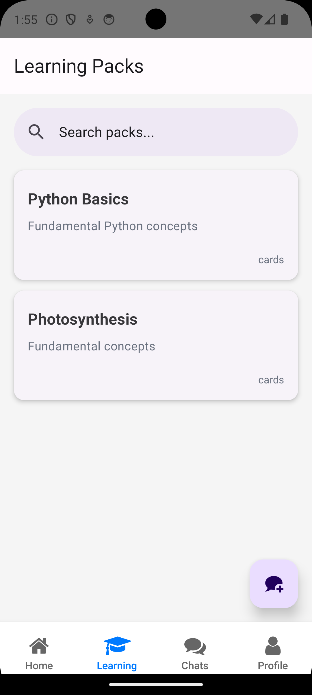
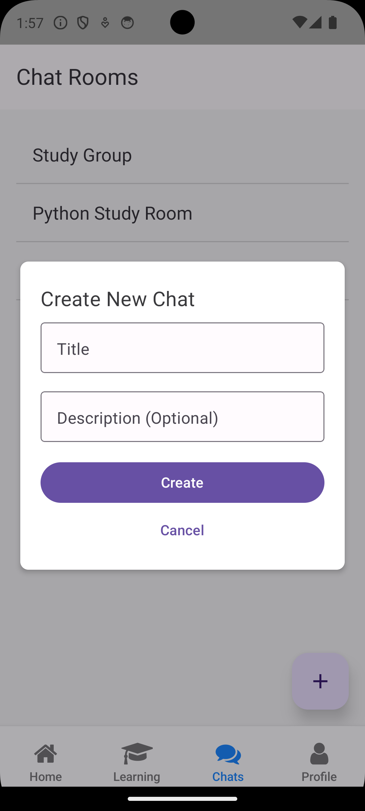

# UltraLearning: The Future of AI-Powered Education


**UltraLearning** is a revolutionary 3-tier application designed to transform the learning experience. By leveraging a cutting-edge AI stack, including Large Language Models (LLMs), Retrieval-Augmented Generation (RAG), and autonomous agents, we deliver a personalized and engaging educational platform.

## ✨ Key Features

- **🧠 AI-Powered Learning:** Personalized content, summaries, and explanations generated by our advanced AI.
- **🃏 Interactive Flashcards:** Create, share, and study with smart flashcards that adapt to your learning pace.
- **🏆 Gamification & Leaderboards:** Earn points, badges, and compete with friends to make learning fun and motivating.
- **📊 Personalized Dashboards:** Track your progress, identify strengths and weaknesses, and get actionable insights.
- **🤖 Autonomous Agents:** AI agents that can research, answer questions, and provide real-time assistance.
- **💬 Real-time Chat:** Engage in interactive learning sessions with AI tutors and fellow learners.
- **🔐 Secure Authentication:** User authentication with JSON Web Tokens (JWT) for secure access to the platform.
- **📄 Document Upload and Processing:** Upload your own documents and have them processed and integrated into your learning materials.

## 🚀 Tech Stack

Our platform is built on a modern, scalable, and robust technology stack:

- **Frontend (Web):**
  - [Next.js](https://nextjs.org/)
  - [React](https://reactjs.org/)
  - [TypeScript](https://www.typescriptlang.org/)
  - [Tailwind CSS](https://tailwindcss.com/)

- **Backend (API):**
  - [Flask](https://flask.palletsprojects.com/)
  - [Python](https://www.python.org/)
  - [SQLAlchemy](https://www.sqlalchemy.org/)
  - [PostgreSQL](https://www.postgresql.org/)

- **Mobile App:**
  - [React Native](https://reactnative.dev/)
  - [TypeScript](https://www.typescriptlang.org/)

- **AI & Machine Learning:**
  - [LangChain](https://www.langchain.com/)
  - [OpenAI](https://openai.com/)
  - [Milvus](https://milvus.io/) for Vector Search (RAG)
  - Sentence Transformers for embeddings (`all-MiniLM-L6-v2`)
  - Llama Model for local LLM inference
  - Model Context Protocol (MCP)

- **Deployment & Infrastructure:**
  - [Docker](https://www.docker.com/)
  - [Nginx](https://www.nginx.com/)

## 🏗️ Architecture Overview

The UltraLearning platform is designed using a 3-tier architecture to ensure separation of concerns, scalability, and maintainability.

- **`./web` (Presentation Tier):** A Next.js application that provides a rich, interactive user interface for the web.
- **`./api` (Application Tier):** A Flask-based RESTful API that houses the core business logic, AI integrations, and data processing.
- **`./mobile` (Presentation Tier):** A React Native application for a seamless mobile experience on iOS and Android.
- **`./docker` (Data Tier):** Contains the database and other services, all managed via Docker Compose for easy setup and deployment.

### Quick Look

#### Mobile


#### Web


## 🏁 Getting Started

Follow these instructions to get the UltraLearning platform up and running on your local machine.

### Prerequisites

- [Node.js](https://nodejs.org/) (v18 or later)
- [Python](https://www.python.org/) (v3.9 or later)
- [Docker](https://www.docker.com/get-started) & [Docker Compose](https://docs.docker.com/compose/install/)
- [Git](https://git-scm.com/)

### Installation

1.  **Clone the repository:**
    ```bash
    git clone https://github.com/your-username/ultra-learning.git
    cd ultra-learning
    ```

2.  **Set up environment variables:**
    Create `.env` files in the root, `api`, and `web` directories by copying the respective `.env.example` or `.env.dev` files.
    ```bash
    cp .env.dev .env
    cp api/.env.dev api/.env
    cp web/.env.local web/.env
    ```
    Update the variables in each `.env` file as needed.

3.  **Launch the backend and database:**
    ```bash
    docker-compose up -d --build
    ```
    This will start the PostgreSQL database and the Flask API.

4.  **Install API dependencies and run migrations:**
    ```bash
    cd api
    pip install -r requirements.txt
    flask db upgrade
    cd ..
    ```

5.  **Install web app dependencies and run:**
    ```bash
    cd web
    npm install
    npm run dev
    ```
    The web application will be available at `http://localhost:3000`.

6.  **Install mobile app dependencies and run:**
    ```bash
    cd mobile
    npm install
    # For iOS
    npx react-native run-ios
    # For Android
    npx react-native run-android
    ```

## API Endpoints

The backend API provides the following endpoints:

-   `/auth`: User authentication and registration.
-   `/chat`: Real-time chat with AI tutors and other users.
-   `/dashboard`: User progress and performance data.
-   `/engagement`: Gamification features, such as leaderboards and badges.
-   `/learning`: Flashcards, quizzes, and other learning materials.
-   `/llm`: Interaction with the Large Language Models.
-   `/rag`: Document upload and processing for Retrieval-Augmented Generation.

For more details, please refer to the Postman collection in the `api` directory.

## 🤝 Contributing

We welcome contributions from the community! If you'd like to contribute, please follow these steps:

1.  Fork the repository.
2.  Create a new branch (`git checkout -b feature/your-feature-name`).
3.  Make your changes and commit them (`git commit -m 'Add some feature'`).
4.  Push to the branch (`git push origin feature/your-feature-name`).
5.  Open a pull request.

Please make sure to update tests as appropriate.

## 📜 License

This project is licensed under the MIT License. See the [LICENSE](LICENSE) file for details.

---

<p align="center">
  Made with ❤️ by the UltraLearning Team
</p>

## 📸 Screenshots

### Mobile App








### Web App


